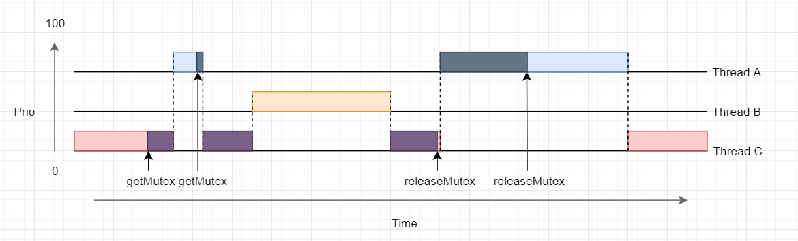

Priority inversion is a ... when a less priority task is runned over a higher priority task.

=> This always happens when a higher priority task is waiting for a lower priority task to complete the use of a shared ressource (protected by a mutex)

