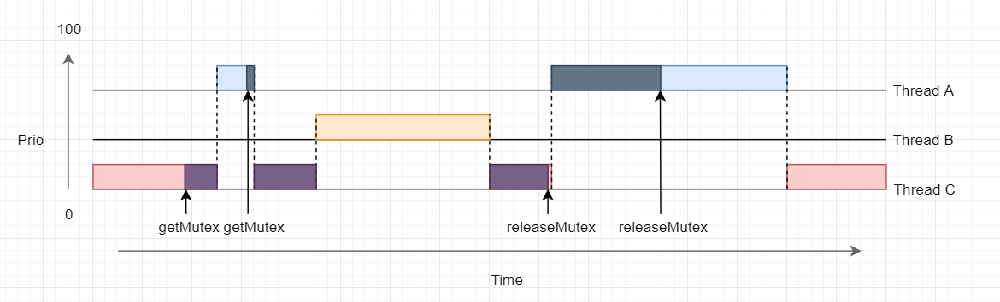

Priority inversion is a a operating system scenario in which a higher priority process is preempted by a lower priority process.

=> This always happens when a higher priority task is waiting for a lower priority task to complete the use of a shared ressource (protected by a mutex)

# Common solutions

* Disabling interrupts

When the lower priority owner get the mutex, the system disables interrupt so no one can preempt the low priority task when the mutex is locked. After the end of usage of the mutex the higher priority task can be runned and then the medium...

* Priority inheritance mutexes

By default, if a thread with a higher priority than the mutex owner attempts to lock a mutex, then the effective priority of the current owner is increased to that of the higher-priority blocked thread waiting for the mutex. The current owner's effective priority is again adjusted when it unlocks the mutex; its new priority is the maximum of its own priority and the priorities of those threads it still blocks, either directly or indirectly.

* Priority Ceiling

The locking variable has its own priority.